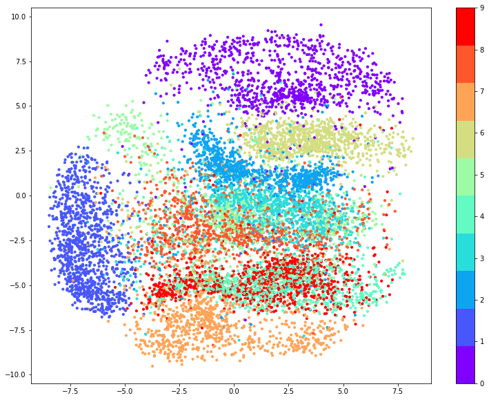
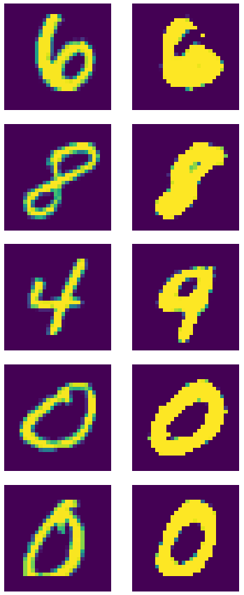
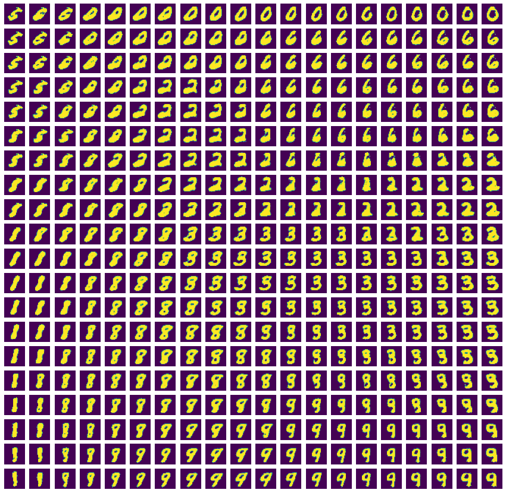

Variational AutoEncoder trained on MNIST
=============

## Model
### Gaussian MLP as Encoder:  
> MLP: FC(784, 500) → ELU → Dropout → FC(500, 500) → Tanh → Dropout  
> Mean: MLP → FC(500, nz)  
> Logvar: MLP → FC(500, nz)  
> Reparametrize: sqrt(exp(Logvar)) * epsilon + Mean  (epsilon ~ N(0,1))  
  
### Bernoulli MLP as Decoder:  
> MLP: FC(nz, 500) → Tanh → FC(500, 500) → ELU → FC(500, 784) → Sigmoid  

### Loss: Reconstruction Loss (CrossEntrophy) + KL Divergence Loss  
  
------------------
## Output Images  
  

------------------
## Distribution of test images in 2D space  
  

------------------
## Reconstruction  
  

------------------
## Make new handwritting digits by decoder  

